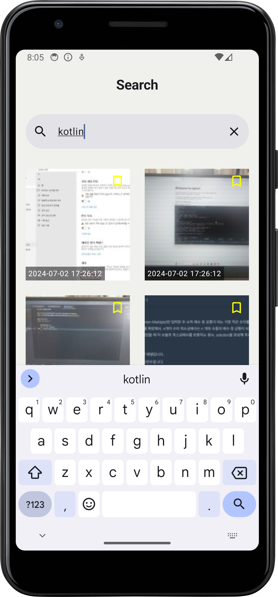

# 이승배 노머스 사전과제

## 이미지 검색 앱

  
  
  
  

## Language
* Kotlin

## Libraries
* AndroidX
* Kotlin Libraries (Coroutine, DataTime, Serialization)
* Compose
  * Material3
  * Navigation
* Paging3
* Retrofit
* room
* Hilt
* Coil

## Gradle Dependency
Gradle Version Catalog

## Architecture
* Layered Architecture 
  * Data
  * Domain
  * Presentation

## Module
Multi-module 구조 
* Core 모듈 
  * common
  * designsystem
  * data
  * database
  * network
  * model
  * domain
* Feature 모듈
  * search
  * bookmark